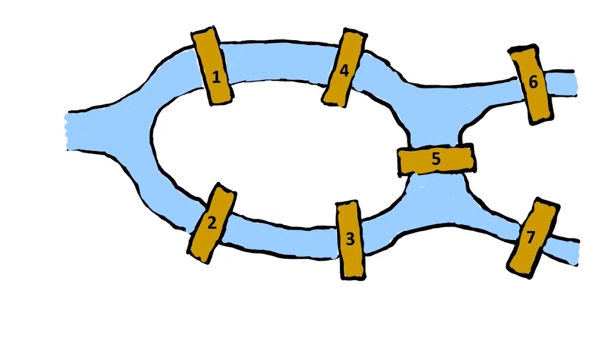
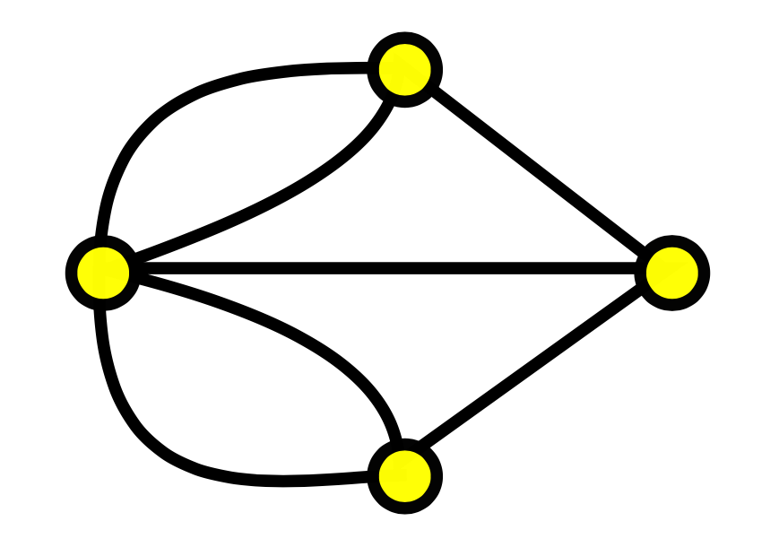

## কনিসবার্গের ভয়ানক সেতু সমস্যা

কনিসবার্গ শহরের ঠিক মাঝখান দিয়ে একটা নদী যায়। নাম তার প্রেগেল। নদীটা যদি শুধুই, 

> আমাদের ছোট নদী চলে বাঁকে বাঁকে
বৈশাখ মাসে তার হাঁটু জল থাকে
> 

এর মত চলাচল করত তাহলে তো কোন সমস্যাই ছিল না। আসল সমস্যা তো হল যখন নদী মনে মনে ভাবল কেননা আমি এইখানে একটা দ্বীপ চাই। নদী এমন ভাবেই আছে যে শহরের মাঝে দুটি বিচ্ছিন্ন দ্বীপ হয়ে গেছে। 

এখন আগেই বলেছি এইটা তেমন বড় নদী না। “আমাদের ছোট নদী” তাই এখান সেখান দিয়ে পার হওয়ার জন্য এই নদীর উপর সব মিলিয়ে ৭ টা সেতু তৈরি করা হয়েছিল। এতে সাধারন মানুষের সমস্যা না হলেও গণিতবিদ দের রাতের ঘুম হারাম করে দিল একটা প্রশ্ন।

> ভাই, সকল ব্রিজে অন্তত একবার পার হয়ে কি আমি সবগুলো যায়গা ভ্রমণ করতে পারবব শহরের ?
> 

উত্তরটা আপাত দৃষ্টিতে সহজ বলে ধারনা হলেও মোটেই সহজ ছিল না। অনেকেই চেষ্টা করল এইটা সমাধান করার। কিন্তু কেউ ই ঠিক সমাধানটা দিতে পারছিল না। এঁকে এঁকে সবাই হয়রান হয়ে গেল কিন্তু কেউ পারল না। 

সব শেষে, সকলে ছুটল মহা গণিতবিদ অয়লার সাহেবের কাছে। অয়লার সাহেব তখন অনেক অনেক চিন্তা ভাবনা করে করে একটা সঠিক সমাধান বের করলেন। তিনি বললেন যে এই কাজ তোমার আমার কারো দ্বারা হবে না। কারন এ কাজ অসাধ্য। 

## অয়লার ভাই এর বুদ্ধি

অয়লার ভাই বললেন দেখ শহরের উত্তরে গেলে তুমি যেই ব্রীজ দিয়েই যাও উত্তর অংশে যাইতেস। কাজেই যেকোন একটা অংশ দিয়ে গেলেই ধরে নিলাম উত্তর গেস। একই কথা দক্ষিন, মধ্যদ্বীপ আর ডানের দ্বীপের জন্য। 

তাহলে আমরা পৌছানোর পয়েন্ট গুলাকে একটা গোল্লা(নোড) আর রাস্তা গুলাকে দাগ (এজ) দিয়ে প্রকাশ করি। জিনিসটা এরকম হবে দেখতে, 

যেহেতু একটা রাস্তা একবার ই ব্যবহার হবে। তাই যেকোন পয়েন্ট যদি বিজোড় সংখ্যক রাস্তার মাথা হয় আর যদি যেইটা শুরু বা শেষ এর পয়েন্ট না হয় তাইলেই আর মিলানো সম্ভব না। 

কারন কোন একটা এমন গোল্লা (নোড) আসবেই যেখানে আগে একবার এসেছ । গিয়েছ। সব রাস্তা পুরন করতে আবার এসেছ কিন্তু এবার আর যাওয়ার রাস্তা পাচ্ছ না। কারন ৩ টা ছিল, ৩ টা ব্যবহার হয়ে গেছে। 

তাই আমরা বলতে পারি খুব সহজে যে এখানে চারটা নোডেই ৩ টা করে রাস্তার মাথা আছে। কাজেই কোনভাবেই এখানে সব রাস্তা অন্তত এবং সর্বোচ্চ একবার দিয়ে পুরো শহর ঘুরে দেখা সম্ভব না। 

###  অয়লার ভাই জিন্দাবাদ